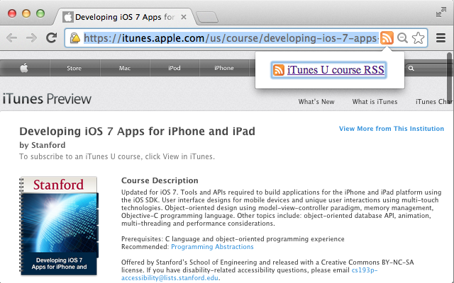

## RSS links for iTunes U courses

Get the RSS links for iTunes U courses directly from the course pages, 
allowing you to subscribe with any podcast client.

### Usage

On iTunes U course web "preview" pages, an orange RSS feed icon will 
appear in the Chrome omnibox. Click on the icon to open a popup, then 
click on the link in the popup to view the course's RSS feed. 

You can then subscribe to the course's RSS feed with any podcast 
client or RSS reader. 

The extension will not appear on non-iTunes-U web pages. 

### Install

Install the extension from the [Chrome Web store page](https://chrome.google.com/webstore/detail/rss-links-for-itunes-u-co/gmmjfgbacaloikamokicljdicelmdihp).

